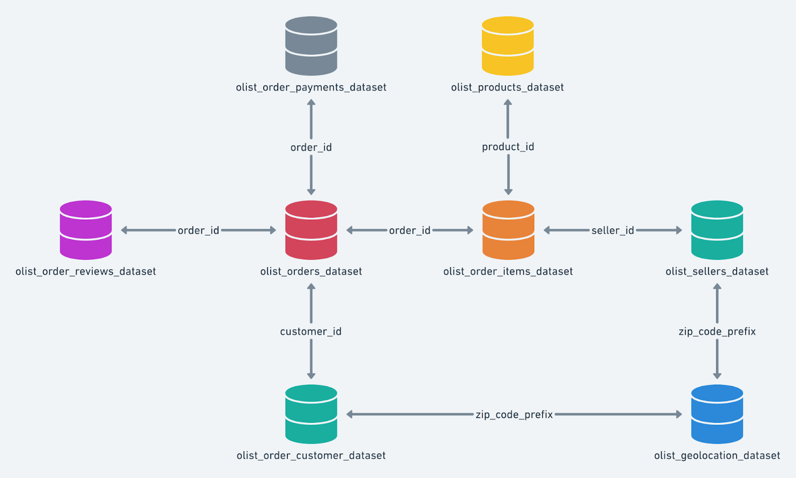

```{r defineconnection, include=FALSE}
library(RMySQL)
library(knitr)
library(kableExtra)

target_db <- dbConnect(RMySQL::MySQL(),
                 dbname = "Target",
                 host = "172.18.0.2",
                 port = 3306,  # Default MySQL port
                 user = "root",
                 password = "password")
```

### Context:

Target is a globally renowned brand and a prominent retailer in the United States. Target makes itself a preferred shopping destination by offering outstanding value, inspiration, innovation and an exceptional guest experience that no other retailer can deliver.

This particular business case focuses on the operations of Target in Brazil and provides insightful information about 100,000 orders placed between 2016 and 2018. The dataset offers a comprehensive view of various dimensions including the order status, price, payment and freight performance, customer location, product attributes, and customer reviews.

By analyzing this extensive dataset, it becomes possible to gain valuable insights into Target's operations in Brazil. The information can shed light on various aspects of the business, such as order processing, pricing strategies, payment and shipping efficiency, customer demographics, product characteristics, and customer satisfaction levels.

### Dataset:

The data is available in 8 csv files at [Google Drive](https://drive.google.com/drive/folders/1TGEc66YKbD443nslRi1bWgVd238gJCnb)

1. customers.csv  
2. sellers.csv  
3. order_items.csv  
4. geolocation.csv  
5. payments.csv  
6. reviews.csv  
7. orders.csv  
8. products.csv  

The column description for these csv files is given below.

The **customers.csv** contain following features:

```{r echo = FALSE, results = TRUE}
Features  <- c("customer_id","customer_unique_id","customer_zip_code_prefix","customer_city","customer_state")
Description <- c("ID of the consumer who made the purchase","Unique ID of the consumer","Zip Code of consumer’s location","Name of the City from where order is made","State Code from where order is made (Eg. são paulo - SP)")
d <- data.frame(Features, Description)
knitr::kable(d) %>%
  kable_styling(position = "left")
```

The **sellers.csv** contains following features:

```{r echo = FALSE, results = TRUE}
Features  <- c("seller_id","seller_zip_code_prefix","seller_city","seller_state")
Description <- c("Unique ID of the seller registered","Zip Code of the seller’s location","Name of the City of the seller","State Code (Eg. são paulo - SP)")
d <- data.frame(Features, Description)
knitr::kable(d) %>%
  kable_styling(position = "left")
```

The **order_items.csv** contain following features:

```{r echo = FALSE, results = TRUE}
Features  <- c("order_id","order_item_id","product_id","seller_id","shipping_limit_date","price","freight_value")
Description <- c("A Unique ID of order made by the consumers","A Unique ID given to each item ordered in the order","A Unique ID given to each product available on the site","Unique ID of the seller registered in Target","The date before which the ordered product must be shipped","Actual price of the products ordered","Price rate at which a product is delivered from one point to another")
d <- data.frame(Features, Description)
knitr::kable(d) %>%
  kable_styling(position = "left")
```

The **geolocations.csv** contain following features:

```{r echo = FALSE, results = TRUE}
Features  <- c("geolocation_zip_code_prefix","geolocation_lat","geolocation_lng","geolocation_city","geolocation_state")
Description <- c("First 5 digits of Zip Code","Latitude","Longitude","City","State")
d <- data.frame(Features, Description)
knitr::kable(d) %>%
  kable_styling(position = "left")
```

The **payments.csv** contain following features:

```{r echo = FALSE, results = TRUE}
Features  <- c("order_id","payment_sequential","payment_type","payment_installments","payment_value")
Description <- c("A Unique ID of order made by the consumers","Sequences of the payments made in case of EMI","Mode of payment used (Eg. Credit Card)","Number of installments in case of EMI purchase","Total amount paid for the purchase order")
d <- data.frame(Features, Description)
knitr::kable(d) %>%
  kable_styling(position = "left")
```

The **orders.csv** contain following features:

```{r echo = FALSE, results = TRUE}
Features  <- c("order_id","customer_id","order_status","order_purchase_timestamp","order_delivered_carrier_date","order_delivered_customer_date","order_estimated_delivery_date")
Description <- c("A Unique ID of order made by the consumers","ID of the consumer who made the purchase","Status of the order made i.e. delivered, shipped, etc.","Timestamp of the purchase","Delivery date at which carrier made the delivery","Date at which customer got the product","Estimated delivery date of the products")
d <- data.frame(Features, Description)
knitr::kable(d) %>%
  kable_styling(position = "left")
```

The **reviews.csv** contain following features:

```{r echo = FALSE, results = TRUE}
Features  <- c("review_id","order_id","review_score","review_comment_title","review_comment_message","review_creation_date","review_answer_timestamp")
Description <- c("ID of the review given on the product ordered by the order id","A Unique ID of order made by the consumers","Review score given by the customer for each order on a scale of 1-5","Title of the review","Review comments posted by the consumer for each order","Timestamp of the review when it is created","Timestamp of the review answered")
d <- data.frame(Features, Description)
knitr::kable(d) %>%
  kable_styling(position = "left")
```

The **products.csv** contain following features:

```{r echo = FALSE, results = TRUE}
Features  <- c("product_id","product_category_name","product_name_lenght","product_description_lenght","product_photos_qty","product_weight_g","product_length_cm","product_height_cm","product_width_cm")
Description <- c("A Unique identifier for the proposed project","Name of the product category","Length of the string which specifies the name given to the products ordered","Length of the description written for each product ordered on the site","Number of photos of each product ordered available on the shopping portal","Weight of the products ordered in grams","Length of the products ordered in centimeters","Height of the products ordered in centimeters","Width of the product ordered in centimeters")
d <- data.frame(Features, Description)
knitr::kable(d) %>%
  kable_styling(position = "left")
```

### Dataset schema:



### Observations in the dataset

Two files, order_reviews.csv and geolocation.csv had unclean data.  

**Issues Identified in the order_reviews.csv file:**  

*Encoding Issue:* The file had to be read with ISO-8859-1 encoding instead of UTF-8.  

*Null Values:* The review_comment_title column has many null values.  

*Date and Time Formatting:* The review_creation_date and review_answer_timestamp
columns are in string format and not properly parsed as datetime objects.  

*Steps to Correct Issues:*  

1. Ensure consistent encoding.  
2. Handle null values in review_comment_title.  
3. Convert date and time columns to proper datetime format.  

*Cleaning Data:*  

1. Strip leading/trailing spaces in text fields.  
2. Replace any special characters or non-UTF-8 characters in text fields.  
3. Check for null or empty values and handle them appropriately.  
4. Convert date and time columns to datetime format.  


**Issues Identified in the geolocation.csv file:**  

*Encoding Issue:* The file had to be read with ISO-8859-1 encoding instead of UTF-8.  

*Null Values:* The review_comment_title column has many null values.  

*Date and Time Formatting:* The review_creation_date and review_answer_timestamp
columns are in string format and not properly parsed as datetime objects.  

*Steps to Correct Issues:*  

1. Special characters in text fields.  
2. Trailing or leading spaces.  
3. Null or empty values.  
4. Ensure that the file does not have any rows that might cause issues.  

*Cleaning Data:*

1. Strip leading/trailing spaces in text fields.  
2. Replace any special characters or non-UTF-8 characters in text fields.  
3. Check for null or empty values and handle them appropriately.  

All the 27 *geolocation_state* listed in the *geolocations.csv* file and *customer_state* in *customers.csv* are 26 states and 1 federal territory of Brazil.
Hence, the data is specific to Brazil customers.

### Problem Statement:

Assuming you are a data analyst/ scientist at Target, you have been assigned the task of analyzing the given dataset to extract valuable insights and provide actionable recommendations.

**What does 'good' look like?**

**1. Import the dataset and do usual exploratory analysis steps like checking the structure & characteristics of the dataset:**

1.1. Data type of all columns in the "customers" table.

```{sql, connection=target_db}
DESCRIBE customers;
```

1.2. Get the time range between which the orders were placed.

```{sql, connection=target_db}
SELECT 
    MIN(order_purchase_timestamp) AS order_start_date, 
    MAX(order_purchase_timestamp) AS order_end_date,
    DATEDIFF(MAX(order_purchase_timestamp), MIN(order_purchase_timestamp)) 
      AS order_time_range_days
FROM 
    orders;
```
     
1.3. Count the Cities & States of customers who ordered during the given period.

```{sql, connection=target_db}
SELECT DISTINCT c.customer_city, c.customer_state, COUNT(*) AS customer_count
FROM orders AS o
JOIN customers AS c
ON o.customer_id = c.customer_id
GROUP BY c.customer_city, c.customer_state
ORDER BY customer_count DESC
    
```

**2. In-depth Exploration:**  

2.1 Is there a growing trend in the no. of orders placed over the past years?  

The purchases were made in the year 2016, 2017 and 2018.

```{sql, connection=target_db}
SELECT DISTINCT YEAR(order_purchase_timestamp) AS year_of_orders
FROM orders
ORDER BY year_of_orders;
```

Trend for 2016 does not show conclusive evidence of a growing trend.

```{sql, connection=target_db}
SELECT DISTINCT CONCAT(MONTHNAME(order_purchase_timestamp), " ", "2016") as month,
       MONTH(order_purchase_timestamp) as month_number,
       COUNT(order_id) OVER (PARTITION BY MONTH(order_purchase_timestamp))
        AS order_count
FROM orders
WHERE YEAR(order_purchase_timestamp) = 2016
ORDER BY MONTH(order_purchase_timestamp);
```

Trend for 2017 shows growth in month-on-month sale throughout the year.

```{sql, connection=target_db}
SELECT DISTINCT CONCAT(MONTHNAME(order_purchase_timestamp), " ", "2017") as month,
       MONTH(order_purchase_timestamp) as month_number,
       COUNT(order_id) OVER (PARTITION BY MONTH(order_purchase_timestamp))
        AS order_count
FROM orders
WHERE YEAR(order_purchase_timestamp) = 2017
ORDER BY MONTH(order_purchase_timestamp);
```

Trend for 2018 shows growth in month-on-month sale throughout the year.

```{sql, connection=target_db}
SELECT DISTINCT CONCAT(MONTHNAME(order_purchase_timestamp), " ", "2018") as month,
       MONTH(order_purchase_timestamp) as month_number,
       COUNT(order_id) OVER (PARTITION BY MONTH(order_purchase_timestamp))
        AS order_count
FROM orders
WHERE YEAR(order_purchase_timestamp) = 2018
ORDER BY MONTH(order_purchase_timestamp);
```

Finding the sales per year shows a year-on-year growing trend.

```{sql, connection=target_db}
SELECT DISTINCT YEAR(order_purchase_timestamp) AS year,
       COUNT(order_id) OVER(PARTITION BY YEAR(order_purchase_timestamp)) 
          AS count_of_orders
FROM orders;
```

2.2. Can we see some kind of monthly seasonality in terms of the no. of orders being placed?

Highest monthly sales in the given data is as follows, but it fails to show any seasonal trend:

```{sql, connection=target_db}
SELECT YEAR(order_purchase_timestamp) as year,
       MONTHNAME(order_purchase_timestamp) as month,
       COUNT(*) as order_count
FROM orders
GROUP BY year, month
ORDER BY order_count DESC;
```

While checking the year-wise monthly sales data, we do not see any monthly seasonality:

```{sql, connection=target_db}
SELECT DISTINCT CONCAT(MONTHNAME(order_purchase_timestamp), " ", "2016") as month,
       MONTH(order_purchase_timestamp) as month_number,
       COUNT(order_id) OVER (PARTITION BY MONTH(order_purchase_timestamp))
        AS order_count
FROM orders
WHERE YEAR(order_purchase_timestamp) = 2016
ORDER BY order_count DESC;
```

```{sql, connection=target_db}
SELECT DISTINCT CONCAT(MONTHNAME(order_purchase_timestamp), " ", "2017") as month,
       MONTH(order_purchase_timestamp) as month_number,
       COUNT(order_id) OVER (PARTITION BY MONTH(order_purchase_timestamp))
        AS order_count
FROM orders
WHERE YEAR(order_purchase_timestamp) = 2017
ORDER BY order_count DESC;
```

```{sql, connection=target_db}
SELECT DISTINCT CONCAT(MONTHNAME(order_purchase_timestamp), " ", "2018") as month,
       MONTH(order_purchase_timestamp) as month_number,
       COUNT(order_id) OVER (PARTITION BY MONTH(order_purchase_timestamp))
        AS order_count
FROM orders
WHERE YEAR(order_purchase_timestamp) = 2018
ORDER BY order_count DESC;
```

2.3. During what time of the day, do the Brazilian customers mostly place their orders? (Dawn, Morning, Afternoon or Night)  

0-6 hrs : Dawn  
7-12 hrs : Mornings  
13-18 hrs : Afternoon  
19-23 hrs : Night  

As per the data, Brazilian customers prefer placing their orders during afternoon.

```{sql, connection=target_db}
SELECT DISTINCT d.time_of_day, COUNT(d.time_of_day) OVER(PARTITION BY d.time_of_day) 
        AS count_of_orders
FROM
(SELECT customer_id, order_purchase_timestamp,
       CASE
          WHEN FLOOR(EXTRACT(HOUR FROM order_purchase_timestamp)) BETWEEN 0 AND 6 THEN
            "Dawn"
          WHEN FLOOR(EXTRACT(HOUR FROM order_purchase_timestamp)) BETWEEN 7 AND 12 THEN
            "Mornings"
          WHEN FLOOR(EXTRACT(HOUR FROM order_purchase_timestamp)) BETWEEN 13 AND 18 THEN
            "Afternoon"
          WHEN FLOOR(EXTRACT(HOUR FROM order_purchase_timestamp)) BETWEEN 19 AND 23 THEN
            "Night"
       END AS time_of_day
FROM orders) as d
ORDER BY count_of_orders DESC
```

**3. Evolution of E-commerce orders in the Brazil region:**  

3.1. Get the month on month no. of orders placed in each state.

```{sql, connection=target_db}
SELECT c.customer_state,
    EXTRACT(YEAR FROM o.order_purchase_timestamp) AS year,
    MONTHNAME(o.order_purchase_timestamp) AS month_name,
    EXTRACT(MONTH FROM o.order_purchase_timestamp) AS month_number,
    COUNT(o.order_id) AS order_count
FROM customers as c
JOIN orders as o
ON c.customer_id = o.customer_id
GROUP By c.customer_state,
    EXTRACT(YEAR FROM o.order_purchase_timestamp),
    MONTHNAME(o.order_purchase_timestamp),
    EXTRACT(MONTH FROM o.order_purchase_timestamp)
ORDER BY c.customer_state, year, month_number;
```

3.2. How are the customers distributed across all the states?  

Distribution of customers across states is as follows:

```{sql, connection=target_db}
SELECT customer_state,
       COUNT(*) AS count_of_customers
FROM customers
GROUP BY customer_state
ORDER BY customer_state;
```

Distribution of customers across cities in those states is as follows:

```{sql, connection=target_db}
SELECT customer_state, customer_city,
       COUNT(*) AS count_of_customers
FROM customers
GROUP BY customer_state, customer_city
ORDER BY customer_state, customer_city;
```

